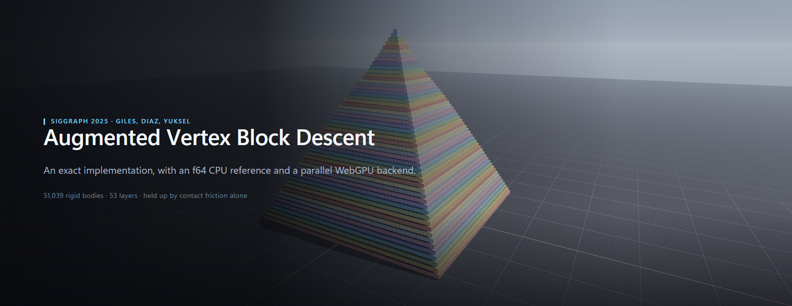
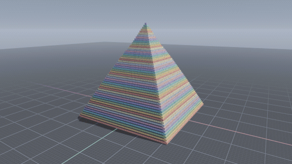
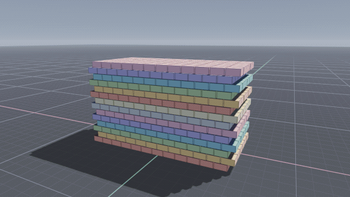
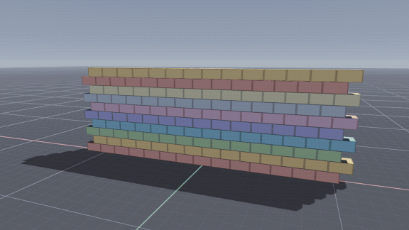
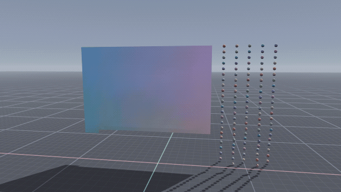
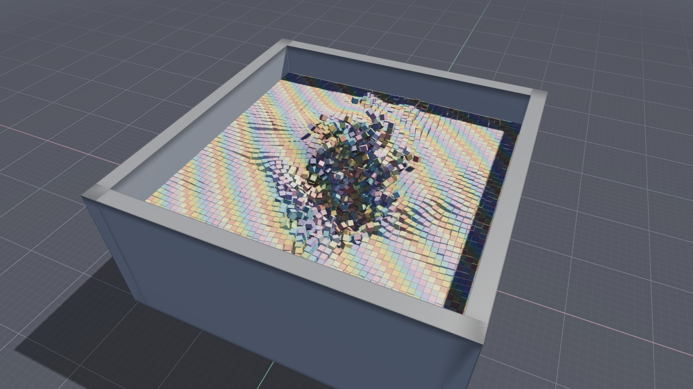

<p align="center">
  
</p>

<p align="center">
  <a href="https://itchyfeetleech.github.io/avbd-sandbox/"><strong>▶ Open the live sandbox</strong></a>
  &nbsp;·&nbsp;
  <a href="docs/implementation.md">Implementation notes</a>
  &nbsp;·&nbsp;
  <a href="https://doi.org/10.1145/3731195">The paper</a>
</p>

<p align="center">
  
  
  
  <a href="https://github.com/itchyfeetleech/avbd-sandbox/actions/workflows/pages.yml"></a>
</p>

---

A browser implementation of **Augmented Vertex Block Descent**, the SIGGRAPH 2025 rigid
body solver by Giles, Diaz and Yuksel.

There are two interchangeable backends behind one scene graph: an f64 CPU engine and a
WebGPU compute backend that solves the same equations in parallel and handles scenes of
tens of thousands of bodies. No build step, no dependencies.

> Chris Giles, Elie Diaz, Cem Yuksel. **Augmented Vertex Block Descent.**
> ACM Transactions on Graphics 44(4), Article 90 (SIGGRAPH 2025).
> [doi:10.1145/3731195](https://doi.org/10.1145/3731195) ·
> [project page](https://graphics.cs.utah.edu/research/projects/avbd/)

## What it does

<table>
<tr>
<td width="50%"></td>
<td width="50%"></td>
</tr>
<tr>
<td><b>Friction-only stacking</b><br>Fifty-three layers of boxes held up by contact friction alone, taking a hit at the apex.</td>
<td><b>Deep frictional pile</b><br>The paper's headline scene: a settled pile, then a heavy impact (Figs. 1 &amp; 3).</td>
</tr>
<tr>
<td></td>
<td></td>
</tr>
<tr>
<td><b>Fracture</b><br>Bricks bonded by hard constraints with a force threshold. The dual variable is the constraint force, so breaking reads straight off it (Fig. 13).</td>
<td><b>Cloth and rope</b><br>Spring-lattice fabric with structural, shear and bend links, tearing at a configurable strain.</td>
</tr>
</table>

## Run it

The hosted build is the easiest way in: **[itchyfeetleech.github.io/avbd-sandbox](https://itchyfeetleech.github.io/avbd-sandbox/)**.

Locally there is no build step — the source is plain ES modules:

```bash
node tools/serve.mjs
# http://127.0.0.1:8123/
```

Opening `index.html` over `file://` will not work; browsers block module imports on that
scheme. Serve a public deployment over HTTPS so WebGPU is available — browsers without it
fall back to the CPU engine and WebGL2, which `?nogpu=1` also forces.

For a single self-contained file that can be emailed or opened directly:

```bash
node tools/bundle.mjs
# writes dist/avbd-sandbox.html
```

## Using the sandbox

| Panel | What it holds |
|---|---|
| **World** | Scene selection, playback, framing, sharing, presentation aids |
| **Build** | Contact-free arrangements of rigid bodies, fabric and ropes, with material presets and optional fine tuning |
| **Lab** | CPU or WebGPU engine, solver fidelity, a GPU-against-CPU cross-check, profiling, world-safety controls |

The toolbar provides **Grab**, **Drop**, **Throw** and **Erase**. Drag empty space to
orbit, right-drag to pan, scroll or pinch to zoom; the same tools work with touch.

<kbd>1</kbd>–<kbd>4</kbd> select tools, <kbd>Space</kbd> pauses, <kbd>.</kbd> steps,
<kbd>R</kbd> restarts, <kbd>Z</kbd> undoes an add, <kbd>F</kbd> fires,
<kbd>Home</kbd> frames the scene, <kbd>H</kbd> hides the controls, <kbd>/</kbd> opens help.

## Two backends, one scene graph

|  | CPU | GPU |
|---|---|---|
| Precision | f64 | f32 |
| Scheduling | sequential Gauss-Seidel | Algorithm 1's parallel form |

The **GPU backend** follows the paper's parallel structure: per-timestep graph colouring
(Section 4), per-color primal dispatches with double-buffered writes, and dual updates for
all constraints in parallel. Broad phase, box SAT and exact sphere narrow phases,
persistent local-space manifolds, material response and the velocity update all run in
compute shaders — a step is one command buffer with no CPU round trip, and the renderer
reads body poses straight out of the solver's storage buffer.

The **CPU backend** solves the same equations sequentially in double precision.

→ [Implementation notes](docs/implementation.md) — what is implemented, equation by
equation; where this follows the paper rather than the authors' demo; how collision,
manifolds and destruction are handled.

## Scenes

Several reproduce figures from the paper: the 50-link heavy pendulum (Fig. 7), two heavy
masses on a chain (Fig. 9), the box stack (Fig. 10), the friction ramp (Fig. 11), the card
tower held by friction (Fig. 6), the 1000:1 stiffness-ratio spring chain (Figs. 2 & 4), the
breakable wall (Fig. 13), and a miniature of the avalanche (Figs. 1 & 3).

Three dense presets — **Mega wall**, **Great pyramid** and **Filled basin** — carry roughly
fifty thousand bodies each and need WebGPU. **Spheres, fabric & ropes** mixes rigid and soft
objects, and the spawner can add spheres, planks, rods, slabs, fabric patches and suspended
rope strands to any scene.

<p align="center">
  <br>
  <em>Filled basin, after something heavy was dropped into it.</em>
</p>

## Layout

```
src/math/          vector, quaternion (Eqs. 20/21), 6x6 LDLᵀ
src/physics/       CPU engine: solver, constraints, collision, broad phase
src/physics/gpu/   WebGPU backend: buffer layout, WGSL kernels, orchestration
src/render/        WebGPU and WebGL2 renderers, orbit camera
src/app/           scenes, UI
tools/capture/     regenerates the media in this README
```

Everything in `docs/media/` is reproducible — `node tools/capture/record.mjs` renders it
from the shipped engine at a fixed timestep. See [tools/capture](tools/capture).

## Licence

The original work in this repository is released under the [MIT License](LICENSE).
The JavaScript ports of the authors' reference maths and collision routines retain the
upstream MIT attribution in [`THIRD_PARTY_NOTICES.md`](THIRD_PARTY_NOTICES.md).
